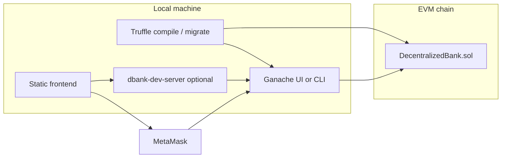

# Decentralized Banking System (D.Bank)

A **college-level prototype** of a minimal on-chain “bank”: users can **deposit ETH**, **withdraw** (with time-based interest logic in the contract), and **borrow** against collateral (token minting is stubbed in Solidity). A **Truffle** workspace deploys Solidity contracts to a **local Ganache** chain; a **static web frontend** talks to the chain through **MetaMask** or an optional **development-only private-key mode**.

This document explains **what each part of the repository does**, **how to run everything locally**, and **how you might publish** the frontend or contracts for coursework or demos—with honest limits of each approach.

---

## Table of contents

1. [Architecture](#architecture)
2. [Repository layout](#repository-layout)
3. [Prerequisites](#prerequisites)
4. [The smart contract (`DecentralizedBank`)](#the-smart-contract-decentralizedbank)
5. [Truffle configuration](#truffle-configuration)
6. [Scripts reference (`package.json`)](#scripts-reference-packagejson)
7. [Frontend application](#frontend-application)
8. [Development server and RPC proxy](#development-server-and-rpc-proxy)
9. [End-to-end local workflow](#end-to-end-local-workflow)
10. [Connecting to the blockchain (MetaMask vs dev key)](#connecting-to-the-blockchain-metamask-vs-dev-key)
11. [Automated tests](#automated-tests)
12. [Deploying for coursework or demos](#deploying-for-coursework-or-demos)
13. [Troubleshooting](#troubleshooting)
14. [Disclaimer](#disclaimer)

---

## Architecture



- **Ganache** simulates Ethereum locally.
- **Truffle** compiles Solidity and publishes contract bytecode to Ganache.
- The **frontend** uses **ethers.js** to call the contract. With **MetaMask**, the user signs transactions in the wallet. With **dev key mode**, a small **Node proxy** forwards JSON-RPC so the browser can sign with a pasted Ganache private key (local prototype only).

---

## Repository layout

| Path | Purpose |
|------|--------|
| `contracts/DecentralizedBank.sol` | Core vault logic: deposit, withdraw, borrow, payOff. |
| `contracts/Migrations.sol` | Standard Truffle migration bookkeeping contract. |
| `migrations/` | Ordered deploy scripts (`1_initial_migration.js`, `2_deploy_contracts.js`). |
| `test/DecentralizedBank.test.js` | Truffle tests against an ephemeral in-process chain. |
| `truffle-config.js` | Networks (`development` on port 8545, `development_gui` on 7545) and Solidity compiler settings. |
| `build/contracts/` | **Generated** ABIs and bytecode after `truffle compile` (do not hand-edit). |
| `frontend/` | Static UI: `index.html`, `css/styles.css`, `js/app.js`. |
| `frontend/js/artifact-lite.json` | Small ABI + deployment map for the browser (**regenerated** by `export:frontend`). |
| `frontend/js/artifact-lite-global.js` | Same data embedded as `window.__DBANK_ARTIFACT__` for reliable first load (**regenerated** with `export:frontend`). |
| `scripts/export-frontend-artifact.js` | Reads Truffle artifact and writes the two lite files above. |
| `scripts/dbank-dev-server.js` | Serves `/frontend/*` and `POST /rpc-proxy` → Ganache for dev-key mode. |
| `package.json` | npm scripts and devDependencies (Truffle, Ganache CLI). |

---

## Prerequisites

- **Node.js** (LTS **18** or **20** recommended; **22** works but Truffle/Ganache may print a harmless µWS native-module warning and fall back to pure JavaScript).
- **npm** (comes with Node).
- **Ganache** (Truffle Suite **desktop** app *or* CLI via this repo’s `ganache` dependency).
- **MetaMask** (browser extension) if you use wallet mode—not required if you use **Ganache private key** mode with `npm run dev`.
- A modern browser (**Chrome** or **Edge** recommended) for MetaMask and for loading the app over `http://localhost`.

---

## The smart contract (`DecentralizedBank`)

**File:** `contracts/DecentralizedBank.sol`

| Feature | Behavior |
|--------|-----------|
| **Deposit** | `payable`, one active deposit per address, minimum **0.01 ETH**. Records balance and start time. |
| **Withdraw** | Requires an active deposit; sends stored principal back; emits `Withdrawn`. Interest is computed in-contract but not paid as separate ERC20 (comments note future ERC20 work). |
| **Borrow** | `payable` collateral (≥ **0.01 ETH**), one loan per address; collateral is locked until `payOff`. Token “mint” is commented / not wired. |
| **Pay off** | Returns collateral minus a **10%** fee retained by the contract logic described in the source. |

**Public mappings** (`isDeposited`, `etherBalanceOf`, etc.) are readable by the frontend for display.

---

## Truffle configuration

**File:** `truffle-config.js`

- **`development`** — `127.0.0.1:8545` for **CLI Ganache** (`npm run start:ganache`).
- **`development_gui`** — `127.0.0.1:7545` for **Ganache Desktop** (default RPC port).
- **Compiler:** Solidity **0.6.12** with the optimizer enabled.

---

## Scripts reference (`package.json`)

| Script | Command | When to use |
|--------|---------|-------------|
| `compile` | `truffle compile` | After changing `.sol` files. |
| `migrate` | `truffle migrate --reset --network development` | Deploy to **CLI Ganache on 8545** (start Ganache first). |
| `migrate:gui` | `truffle migrate --reset --network development_gui` | Deploy to **Ganache Desktop on 7545**. |
| `test` | `truffle test` | Run unit tests (uses Truffle’s built-in chain; no external Ganache required). |
| `test:gui` | `truffle test --network development_gui` | Run tests against GUI Ganache (must be running). |
| `test:chain` | `truffle test --network development` | Run tests against CLI Ganache on 8545. |
| `start:ganache` | `ganache -p 8545 -h 127.0.0.1` | Start **second** local chain on **8545** (avoids clashing with Ganache UI on **7545**). |
| `export:frontend` | `node scripts/export-frontend-artifact.js` | **After migrate**, refreshes `frontend/js/artifact-lite*.json/js` with ABI + deployment addresses. |
| `dev` | `node scripts/dbank-dev-server.js` | **Recommended** for the full UI: static files + **`/rpc-proxy`** for Ganache-key mode (default **http://127.0.0.1:8788**). |
| `serve` | `http-server` on port **5174** | Static files only from repo root; **no** `/rpc-proxy` (MetaMask-only path). |
| `web` | `export:frontend` then `dbank-dev-server` | Quick “export + dev server” chain. |

**Environment variables** (optional):

- `PORT` — override port for `dbank-dev-server` (default **8788**).
- `GANACHE_URL` — override upstream RPC for the proxy (default **`http://127.0.0.1:7545`**).

---

## Frontend application

**Directory:** `frontend/`

| File | Role |
|------|------|
| `index.html` | Page structure, setup banner, connection mode (MetaMask vs Ganache key), contract field, savings/loan panels, activity list. |
| `css/styles.css` | Visual design (typography, layout, dark theme). |
| `js/app.js` | Loads **ethers** (UMD from jsDelivr), loads artifact, connects wallet or dev signer, sends transactions, reads state and events. |
| `js/artifact-lite-global.js` | **Auto-generated**; defines `window.__DBANK_ARTIFACT__`. |

The UI expects the **DecentralizedBank contract address** (from Truffle migrate output or Ganache’s **Contracts** view), **not** a random Ganache **account** address.

---

## Development server and RPC proxy

**File:** `scripts/dbank-dev-server.js`

- Serves **`/frontend/`** from disk (same layout as when you use `http-server` from the repo root).
- Exposes **`POST /rpc-proxy`**, which forwards the JSON-RPC body to **`GANACHE_URL`** (default Ganache UI RPC).

**Why it exists:** browsers block arbitrary cross-origin calls to `http://127.0.0.1:7545` from a page served on another origin/port (**CORS**). MetaMask injects a provider and sidesteps that for wallet users. For **class demos without MetaMask**, the proxy allows **`ethers.Wallet`** in the page to sign against Ganache through same-origin `/rpc-proxy`.

---

## End-to-end local workflow

These steps assume **Ganache Desktop** on **7545** / **5777** (typical UI defaults). Adjust ports if you use CLI Ganache only.

1. **Start Ganache** and confirm RPC **http://127.0.0.1:7545** (or note your actual port).
2. In a terminal, **clone or open** this project folder and install dependencies:
   ```bash
   npm install
   ```
3. **Compile and deploy** to the GUI network:
   ```bash
   npm run migrate:gui
   ```
4. **Export** the ABI and deployment map for the browser:
   ```bash
   npm run export:frontend
   ```
5. **Run the app** (pick one):
   - **Full stack (recommended):**
     ```bash
     npm run dev
     ```
     Open **`http://127.0.0.1:8788/frontend/`** (or the host/port printed in the terminal if you set `PORT`).
   - **Static only:**
     ```bash
     npm run serve
     ```
     Open **`http://127.0.0.1:5174/frontend/`** (use MetaMask; Ganache-key mode will **not** work without `/rpc-proxy`).

6. In the browser, set the **contract address**, connect (**MetaMask** or **Ganache private key** per the UI), and use **Deposit / Withdraw / Borrow / Pay off** as required for your demo.

Whenever you **reset Ganache** or **re-migrate**, run **`npm run export:frontend`** again and refresh the page so deployment addresses stay consistent—or paste the new contract address manually.

---

## Connecting to the blockchain (MetaMask vs dev key)

### MetaMask (browser wallet)

1. Add a **custom network** in MetaMask: RPC **`http://127.0.0.1:7545`** (or your Ganache URL), chain ID **1337** or **5777** depending on what Ganache reports for **`eth_chainId`** (if one fails, try the other for local Ganache builds).
2. **Import** Ganache’s test mnemonic or a private key so your account holds **test ETH**.
3. On the site, choose **MetaMask**, click **Connect wallet**, approve the permission prompt in Chrome/Edge (not an IDE embedded preview).
4. Paste the **DecentralizedBank** address, **Save address**, then transact.

### Ganache private key (development only)

1. Run **`npm run dev`** so **`/rpc-proxy`** exists.
2. In the UI, select **Ganache private key**, paste a key from Ganache → **Accounts** → key icon.
3. **Connect wallet**. Transactions are signed in-page—**never use real keys**; never ship this mode to production.

---

## Automated tests

```bash
npm test
```

Tests live in `test/DecentralizedBank.test.js`. They deploy fresh contract instances and assert deposit, withdraw, borrow, and revert paths.

---

## Deploying for coursework or demos

The word **“deploy”** means two different things here: **contracts on a blockchain**, and **hosting the website**.

### A. Publishing the **frontend** (static files)

You can upload **`frontend/`** (or the whole repo with the app under `/frontend/`) to any **static host**, for example:

- **GitHub Pages** — publish the `frontend` folder; set the site URL so `index.html` resolves and `js/` paths work (often easiest as **`https://<user>.github.io/<repo>/frontend/`**).
- **Netlify** or **Vercel** — drag-and-drop or connect the Git repo; set **publish directory** to `frontend` (or configure rewrites so `/` serves `frontend/index.html`).

**Important limitations:**

- **MetaMask** users must point their wallet at the **same chain** where your contract lives (e.g. a public **Sepolia** RPC if you deployed there—not localhost).
- **`/rpc-proxy`** exists only on **`npm run dev`**; it will **not** exist on GitHub Pages unless you deploy a **separate backend**—so **Ganache-key mode will not work** on plain static hosting.
- **`artifact-lite-global.js`** contains **localhost deployment addresses**; for a public demo you must **re-run migrations on a public testnet**, then **`npm run export:frontend`**, commit the updated lite files **or** configure the UI to read addresses from query params / env at build time (would require a small build step; not included by default).

### B. Publishing **smart contracts** to a public testnet (e.g. Sepolia)

1. Add a **`sepolia`** (or similar) network block to **`truffle-config.js`** with an RPC URL (e.g. Infura, Alchemy) and the **HD wallet / private key** funding pattern Truffle expects (`HDWalletProvider` is common; not pre-wired in this minimal repo).
2. Fund the deployer account with **testnet ETH**.
3. Run:
   ```bash
   truffle migrate --network sepolia
   ```
4. Run **`npm run export:frontend`** so the frontend artifact includes the new **`networks`** entry for that chain ID.
5. Host the frontend over **HTTPS**; users add **Sepolia** in MetaMask and use your **new contract address**.

Exact `truffle-config.js` entries and provider packages depend on your instructor’s requirements—this README does not hardcode third-party API keys.

### If you meant a specific platform (“zplot”)

If **“zplot”** was a typo for **Vercel**, **Netlify**, **GitHub Pages**, or another host, the **static frontend** section above applies: publish `frontend/`, then align MetaMask + contract addresses with whatever chain you actually deployed to.

---

## Troubleshooting

| Symptom | Likely cause | What to try |
|--------|----------------|-------------|
| `EADDRINUSE` on a port | Another process uses that port. | Change `PORT` for `dev`, or use `serve:3000`, or stop the other program. |
| Migrate hangs after compile | Ganache not running or wrong host/port in `truffle-config.js`. | Start Ganache; match **7545** vs **8545** to `development_gui` vs `development`. |
| µWS / `uws_win32` warning | Node 22 vs optional native binary. | Ignore, or use Node 20 LTS. |
| “Not connected” forever | No wallet in this browser tab. | Use Chrome/Edge with MetaMask; avoid IDE-only preview. |
| MetaMask shows **0 ETH** | Wrong account or wrong network. | Import Ganache mnemonic / key; RPC must match Ganache. |
| “No contract code at this address” | Pasted an **account** address instead of **contract** address. | Use **DecentralizedBank** address from migrate or Ganache **Contracts**. |
| Ganache-key mode says no `/rpc-proxy` | Using `npm run serve` instead of **`npm run dev`**. | Run **`npm run dev`**. |
| Deposit button disabled | Not connected. | Connect first; then **Save address** if needed. |

---

## Disclaimer

This project is a **learning prototype**. It is **not** audited financial software, not legal banking, and **must not** be used with real funds or real customer data. The **private-key-in-browser** path exists solely to reduce friction in controlled classroom environments.

---

## License

See `contracts` SPDX headers (MIT) unless your course materials specify otherwise.
